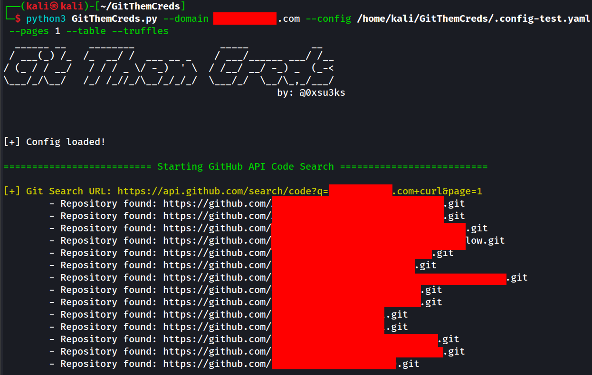
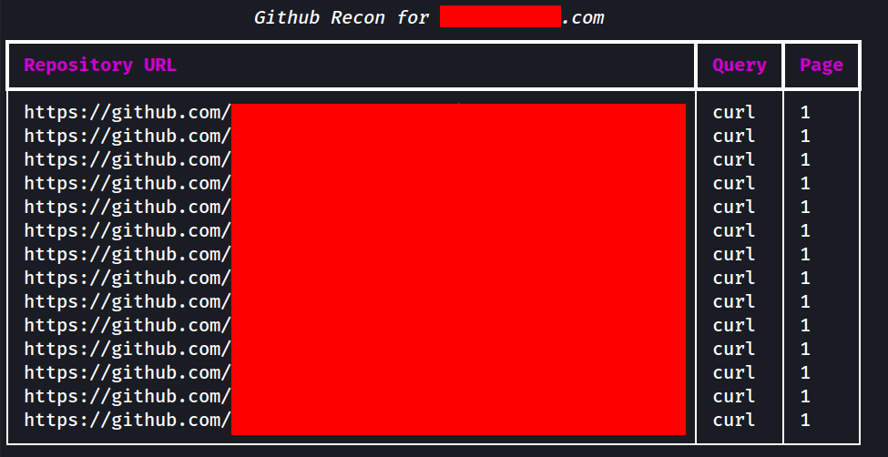
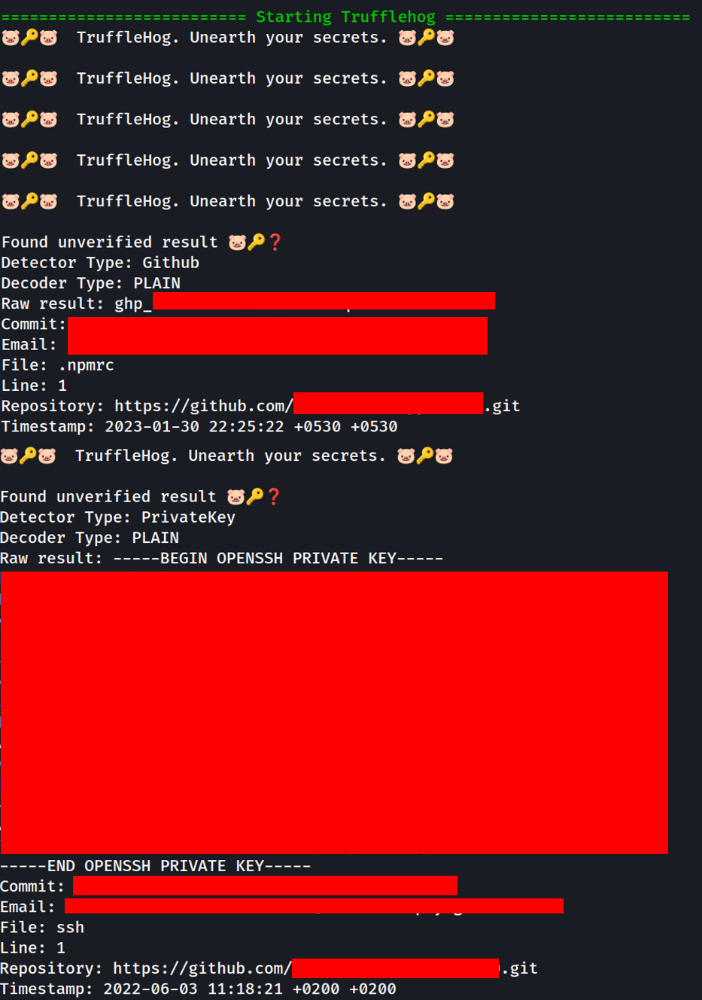
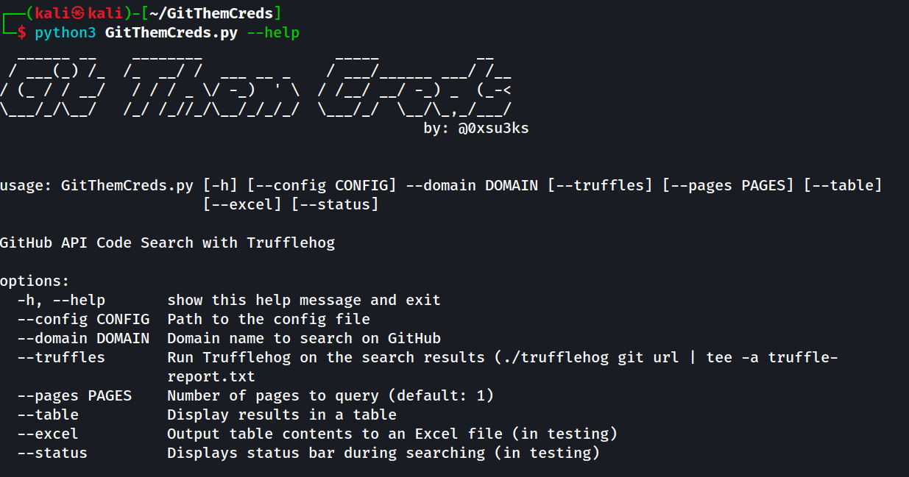

# GitThemCreds

Any questions or feedback please reach out to me in Mattermost or Teams.

To use this script you will need a GitHub Fine Grained Access Token.

https://docs.github.com/en/authentication/keeping-your-account-and-data-secure/creating-a-personal-access-token

Steps:
1. Login to GitHub
2. Go to Settings
3. Scroll to bottom and on left hand side click Developer
4. Generate a Fine Grained Access Token, it begins with "github_pat_XXXXX"
5. Paste into config file

## Screenshots 









## Install
`./setup.sh`

## How It Works
GitThemCreds.py is a python that script that will  search the GitHub API code base searching for a domain you supply like `example.com` + queries loaded from a configuration file.

For example 
`example.com password`
`example.com AWS_SECRET`

The GitHub API is super sensitive to this type of "scraping" or "searching" and has various mechanisms to rate limit the request. To avoid this limitation, there is a hefty pause between queries, around one minute each iteration. You can change this in the script but be aware you'll run into rate limiting fairly quickly.

Some more information here about GitHub's rate limiting nonsense:

https://docs.github.com/en/rest/overview/resources-in-the-rest-api?apiVersion=2022-11-28

If the script runs into rate limiting issues it will slowly begin to add time inbetween reqeusts.

The script will also stream the urls/responses in real time to a text file and also dump the raw JSON for querying with `jq`

Once URLs are collected it runs them through `trufflehog` searching for secrets.

The objective here is to support Red Team Ops by automating the GitHub recon aspect. Everything here is **passive** enumeration so at the beginning of an engagment, start this script in a screen session and let it work, while you continue to focus on other things. Come back later and review the trufflehog report.

## Usage
`python3 GitThemCreds.py --help`



There are a few arguments, only one is required.
### Required Args
`--domain` 

This takes in the first part of your search query and really it could be anything:

`example.com`
`gitlab.example.com`
`jfrog.example.com` 

### Not Required Args
`--config`

This allows you to supply your own YAML configuration file. If you're great with YAML, go for it or just use the one supplied and add/remove dorks.

`--truffles`

Trufflehog will *not* run by default and you must supply this in order to invoke this functionality
Note: The default trufflehog command is:
`/trufflehog git url | tee -a truffle-report.txt`

`--pages` 

This flag allows you to specify how many pages deep you want to search in the API. The default is 1 but it can be anything. Although I woudn't really go past 5 personally.

`--table`

This flag allows you to just print all the findings into a table on the CLI. Nothing crazy but loosks nice for a screenshot.

`--excel`

Outputs to .xlsx file, this is currently in testing and may not work fully.

`--status`

Outputs a status bar to the terminal, this is currently in testing and may not work fully.

## FAQ
+ Can I change the trufflehog command?
	+ Currently you need to edit the python script 
		```            
		    command = f'./trufflehog git {url} | tee -a truffle-report.txt'
            #Need this subprocess to do this
            subprocess.run(command, shell=True, check=True)
     This is found in line 218 in the python script.

+ Why does this take so long?
	+ The GitHub API is super restrictive of it's Code Search API. This script is meant to support Read Team Ops during an engagment and can take a few minutes to hours to complete depending on the organization's exposure on GitHub.
